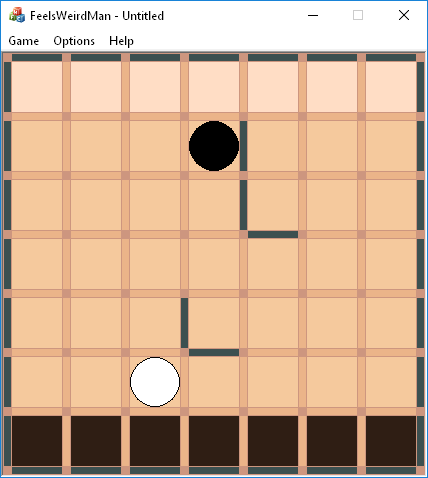

Smple game done as a university project.
Features:
---
* Resizable tiles
* Adjustable board size
* Save/Load system

Rules
---
This game is for two players. Players' goal is to move their token to the other side of the board. On their turn they can set a wall or move their token. A player can't completely block other player with a wall. White player moves first.

